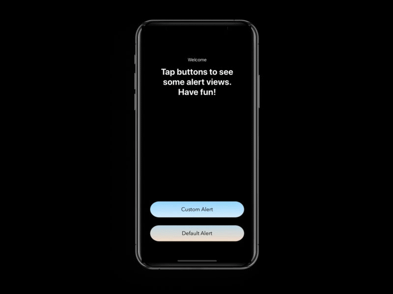

# CustomizedAlertView

# Description
We always need some design touches in our projects to make them pleasing to eye. Alerts are one of that we generally use in our projects and their interface also need to match with our project's interface. So here are some tricks for alerts to change their background color, title and message color and etc.

# Author
Oktay Kurt / kurt21380@gmail.com
